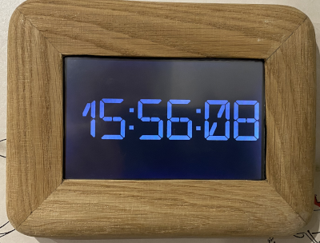
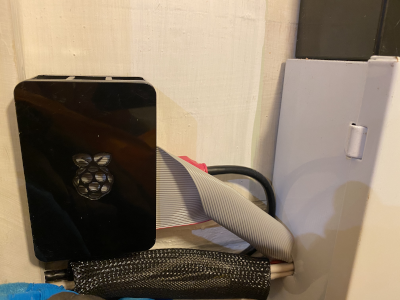
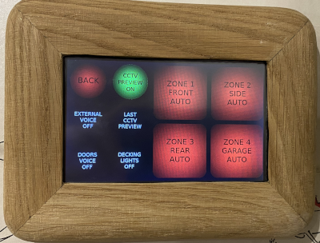
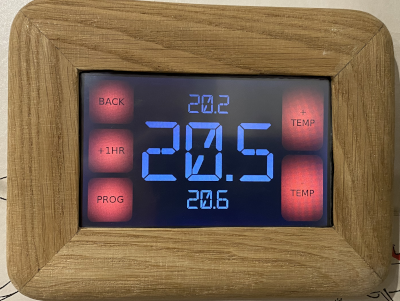
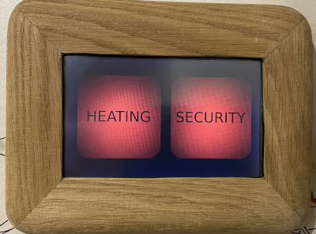
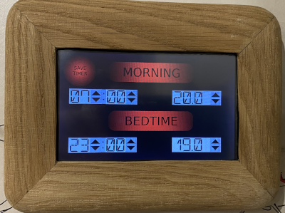

# Home Heating & Security Control

This project controls my heating via a temperature sensor through a Raspberry Pi 3B+ GPIO (General Purpose Input Output) and if the set temperature in my Python GUI (Graphical User Interface) then triggers a relay module which is connected to my Central Heating Boiler. I also have 4x external PIR's (Passive Infra-Red Sensors) which are connected to GPIO's individually and LED Security lighting which are individually connected to a relay modules. Each PIR is linked through the python code to a Security Light due to the position around my house. In the Security menu there are settings for voice announcement through our Google Home Mini's. A recent feature I added was that when an external PIR is triggered that the Raspberry Pi would grab a CCTV picture for the corresponding camera from my networked CCTV system and display on the touch screen for 2 minutes.  Below are some pictures of my custom made frame from off cuts of Oak for the 5" LCD Touchscreen and menus. 
 
The main reason for this project was that our existing GJD Security Lighting Controller touch pad was showing signs of age and our thermostat used AAA batteries and can go through them annually.
